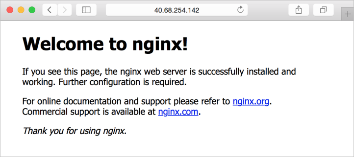

# <a name="how-toouse-docker-machine-toocreate-hosts-in-azure"></a><span data-ttu-id="89543-103">Cómo toouse máquina Docker toocreate se hospeda en Azure</span><span class="sxs-lookup"><span data-stu-id="89543-103">How toouse Docker Machine toocreate hosts in Azure</span></span>
<span data-ttu-id="89543-104">Este artículo detalles de cómo toouse [máquina Docker](https://docs.docker.com/machine/) toocreate hosts en Azure.</span><span class="sxs-lookup"><span data-stu-id="89543-104">This article details how toouse [Docker Machine](https://docs.docker.com/machine/) toocreate hosts in Azure.</span></span> <span data-ttu-id="89543-105">Hola `docker-machine` comando crea una máquina virtual (VM) de Linux en Azure, a continuación, instala Docker.</span><span class="sxs-lookup"><span data-stu-id="89543-105">hello `docker-machine` command creates a Linux virtual machine (VM) in Azure then installs Docker.</span></span> <span data-ttu-id="89543-106">A continuación, puede administrar los hosts de Docker en Azure mediante Hola mismas herramientas locales y los flujos de trabajo.</span><span class="sxs-lookup"><span data-stu-id="89543-106">You can then manage your Docker hosts in Azure using hello same local tools and workflows.</span></span>

## <a name="create-vms-with-docker-machine"></a><span data-ttu-id="89543-107">Creación de VM con la máquina de Docker</span><span class="sxs-lookup"><span data-stu-id="89543-107">Create VMs with Docker Machine</span></span>
<span data-ttu-id="89543-108">En primer lugar, obtenga el identificador de suscripción de Azure con el comando [az account show](/cli/azure/account#show) de la manera siguiente:</span><span class="sxs-lookup"><span data-stu-id="89543-108">First, obtain your Azure subscription ID with [az account show](/cli/azure/account#show) as follows:</span></span>

```azurecli
sub=$(az account show --query "id" -o tsv)
```

<span data-ttu-id="89543-109">Crear máquinas virtuales del host de Docker en Azure con `docker-machine create` especificando *azure* como controlador de Hola.</span><span class="sxs-lookup"><span data-stu-id="89543-109">You create Docker host VMs in Azure with `docker-machine create` by specifying *azure* as hello driver.</span></span> <span data-ttu-id="89543-110">Para obtener más información, vea hello [documentación del controlador de Azure Docker](https://docs.docker.com/machine/drivers/azure/)</span><span class="sxs-lookup"><span data-stu-id="89543-110">For more information, see hello [Docker Azure Driver documentation](https://docs.docker.com/machine/drivers/azure/)</span></span>

<span data-ttu-id="89543-111">Hello en el ejemplo siguiente se crea una máquina virtual denominada *myVM*, crea una cuenta de usuario denominada *azureuser*y abre el puerto *80* hello en el host de máquina virtual.</span><span class="sxs-lookup"><span data-stu-id="89543-111">hello following example creates a VM named *myVM*, creates a user account named *azureuser*, and opens port *80* on hello host VM.</span></span> <span data-ttu-id="89543-112">Siga cualquier toolog indicaciones en tooyour cuenta de Azure y conceder máquina Docker permisos toocreate y administrar los recursos.</span><span class="sxs-lookup"><span data-stu-id="89543-112">Follow any prompts toolog in tooyour Azure account and grant Docker Machine permissions toocreate and manage resources.</span></span>

```bash
docker-machine create -d azure \
    --azure-subscription-id $sub \
    --azure-ssh-user azureuser \
    --azure-open-port 80 \
    myvm
```

<span data-ttu-id="89543-113">salida de Hello tiene un aspecto similar toohello siguiente ejemplo:</span><span class="sxs-lookup"><span data-stu-id="89543-113">hello output looks similar toohello following example:</span></span>

```bash
Creating CA: /Users/user/.docker/machine/certs/ca.pem
Creating client certificate: /Users/user/.docker/machine/certs/cert.pem
Running pre-create checks...
(myvmdocker) Completed machine pre-create checks.
Creating machine...
(myvmdocker) Querying existing resource group.  name="docker-machine"
(myvmdocker) Creating resource group.  name="docker-machine" location="westus"
(myvmdocker) Configuring availability set.  name="docker-machine"
(myvmdocker) Configuring network security group.  name="myvmdocker-firewall" location="westus"
(myvmdocker) Querying if virtual network already exists.  rg="docker-machine" location="westus" name="docker-machine-vnet"
(myvmdocker) Creating virtual network.  name="docker-machine-vnet" rg="docker-machine" location="westus"
(myvmdocker) Configuring subnet.  name="docker-machine" vnet="docker-machine-vnet" cidr="192.168.0.0/16"
(myvmdocker) Creating public IP address.  name="myvmdocker-ip" static=false
(myvmdocker) Creating network interface.  name="myvmdocker-nic"
(myvmdocker) Creating storage account.  sku=Standard_LRS name="vhdski0hvfazyd8mn991cg50" location="westus"
(myvmdocker) Creating virtual machine.  location="westus" size="Standard_A2" username="azureuser" osImage="canonical:UbuntuServer:16.04.0-LTS:latest" name="myvmdocker"
Waiting for machine toobe running, this may take a few minutes...
Detecting operating system of created instance...
Waiting for SSH toobe available...
Detecting hello provisioner...
Provisioning with ubuntu(systemd)...
Installing Docker...
Copying certs toohello local machine directory...
Copying certs toohello remote machine...
Setting Docker configuration on hello remote daemon...
Checking connection tooDocker...
Docker is up and running!
toosee how tooconnect your Docker Client toohello Docker Engine running on this virtual machine, run: docker-machine env myvmdocker
```

## <a name="configure-your-docker-shell"></a><span data-ttu-id="89543-114">Configuración del shell de Docker</span><span class="sxs-lookup"><span data-stu-id="89543-114">Configure your Docker shell</span></span>
<span data-ttu-id="89543-115">host de Docker de tooconnect tooyour en Azure, defina la configuración de conexión adecuada de Hola.</span><span class="sxs-lookup"><span data-stu-id="89543-115">tooconnect tooyour Docker host in Azure, define hello appropriate connection settings.</span></span> <span data-ttu-id="89543-116">Como se indicó al final de Hola de salida de hello, ver información de conexión de hello para el host Docker como se indica a continuación:</span><span class="sxs-lookup"><span data-stu-id="89543-116">As noted at hello end of hello output, view hello connection information for your Docker host as follows:</span></span> 

```bash
docker-machine env myvmdocker
```

<span data-ttu-id="89543-117">Hola de salida es similar toohello siguiente ejemplo:</span><span class="sxs-lookup"><span data-stu-id="89543-117">hello output is similar toohello following example:</span></span>

```bash
export DOCKER_TLS_VERIFY="1"
export DOCKER_HOST="tcp://40.68.254.142:2376"
export DOCKER_CERT_PATH="/Users/user/.docker/machine/machines/machine"
export DOCKER_MACHINE_NAME="machine"
# Run this command tooconfigure your shell:
# eval $(docker-machine env myvmdocker)
```

<span data-ttu-id="89543-118">configuración de la conexión de hello toodefine puede cualquier ejecución Hola sugiere los comandos de configuración (`eval $(docker-machine env myvmdocker)`), o se pueden establecer variables de entorno de hello manualmente.</span><span class="sxs-lookup"><span data-stu-id="89543-118">toodefine hello connection settings you can either run hello suggested configuration command (`eval $(docker-machine env myvmdocker)`), or you can set hello environment variables manually.</span></span> 

## <a name="run-a-container"></a><span data-ttu-id="89543-119">Ejecución de un contenedor</span><span class="sxs-lookup"><span data-stu-id="89543-119">Run a container</span></span>
<span data-ttu-id="89543-120">toosee un contenedor en acción, permite ejecutar un servidor de Web NGINX básica.</span><span class="sxs-lookup"><span data-stu-id="89543-120">toosee a container in action, lets run a basic NGINX webserver.</span></span> <span data-ttu-id="89543-121">Cree un contenedor con `docker run` y exponga el puerto 80 al tráfico web de la manera siguiente:</span><span class="sxs-lookup"><span data-stu-id="89543-121">Create a container with `docker run` and expose port 80 for web traffic as follows:</span></span>

```bash
docker run -d -p 80:80 --restart=always nginx
```

<span data-ttu-id="89543-122">Hola de salida es similar toohello siguiente ejemplo:</span><span class="sxs-lookup"><span data-stu-id="89543-122">hello output is similar toohello following example:</span></span>

```bash
Unable toofind image 'nginx:latest' locally
latest: Pulling from library/nginx
ff3d52d8f55f: Pull complete
226f4ec56ba3: Pull complete
53d7dd52b97d: Pull complete
Digest: sha256:41ad9967ea448d7c2b203c699b429abe1ed5af331cd92533900c6d77490e0268
Status: Downloaded newer image for nginx:latest
675e6056cb81167fe38ab98bf397164b01b998346d24e567f9eb7a7e94fba14a
```

<span data-ttu-id="89543-123">Vea los contenedores en funcionamiento con `docker ps`.</span><span class="sxs-lookup"><span data-stu-id="89543-123">View running containers with `docker ps`.</span></span> <span data-ttu-id="89543-124">Hello siguiente salida de ejemplo muestra hello NGINX que se ejecutan con el puerto 80 expuestas:</span><span class="sxs-lookup"><span data-stu-id="89543-124">hello following example output shows hello NGINX container running with port 80 exposed:</span></span>

```bash
CONTAINER ID    IMAGE    COMMAND                   CREATED          STATUS          PORTS                          NAMES
d5b78f27b335    nginx    "nginx -g 'daemon off"    5 minutes ago    Up 5 minutes    0.0.0.0:80->80/tcp, 443/tcp    festive_mirzakhani
```

## <a name="test-hello-container"></a><span data-ttu-id="89543-125">Contenedor de prueba Hola</span><span class="sxs-lookup"><span data-stu-id="89543-125">Test hello container</span></span>
<span data-ttu-id="89543-126">Obtener dirección IP pública de Hola de host Docker como se indica a continuación:</span><span class="sxs-lookup"><span data-stu-id="89543-126">Obtain hello public IP address of Docker host as follows:</span></span>


```bash
docker-machine ip myvmdocker
```

<span data-ttu-id="89543-127">contenedor de hello toosee en acción, abra un explorador web y escriba la dirección IP pública Hola que se indican en la salida de hello de hello anterior comando:</span><span class="sxs-lookup"><span data-stu-id="89543-127">toosee hello container in action, open a web browser and enter hello public IP address noted in hello output of hello preceding command:</span></span>



## <a name="next-steps"></a><span data-ttu-id="89543-129">Pasos siguientes</span><span class="sxs-lookup"><span data-stu-id="89543-129">Next steps</span></span>
<span data-ttu-id="89543-130">También puede crear hosts con hello [extensión de máquina virtual de Docker](dockerextension.md).</span><span class="sxs-lookup"><span data-stu-id="89543-130">You can also create hosts with hello [Docker VM Extension](dockerextension.md).</span></span> <span data-ttu-id="89543-131">Para ver ejemplos sobre el uso de Docker Compose, consulte [Introducción a Docker y Compose en Azure](docker-compose-quickstart.md).</span><span class="sxs-lookup"><span data-stu-id="89543-131">For examples on using Docker Compose, see [Get started with Docker and Compose in Azure](docker-compose-quickstart.md).</span></span>
