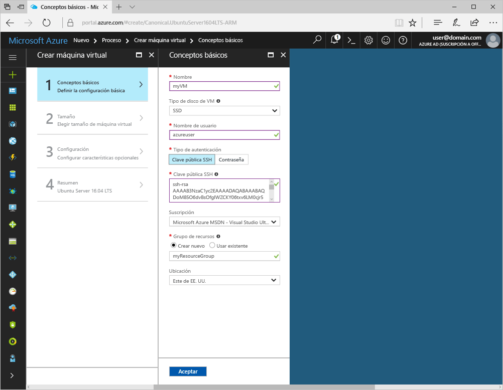
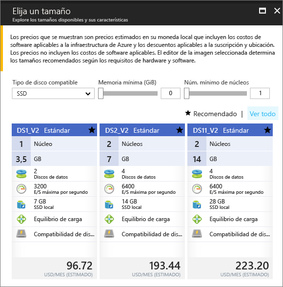

# <a name="create-a-linux-virtual-machine-with-hello-azure-portal"></a>Crear una máquina virtual Linux con hello portal de Azure

Máquinas virtuales de Azure se pueden crear a través de hello portal de Azure. Este método proporciona una interfaz de usuario basada en el explorador para crear y configurar máquinas virtuales y todos los recursos asociados. Este inicio rápido recorre crear una máquina virtual e instalar un servidor Web en hello máquina virtual.

Si no tiene una suscripción a Azure, cree una [cuenta gratuita](https://azure.microsoft.com/free/?WT.mc_id=A261C142F) antes de empezar.

## <a name="create-ssh-key-pair"></a>Creación del par de claves SSH

Es necesario un toocomplete de par de claves SSH este inicio rápido. Si ya tiene un par de claves SSH, puede omitir este paso.

Desde un shell de Bash, ejecute este comando y siga hello en pantalla direcciones. resultado del comando Hello incluye nombre hello del archivo de clave pública Hola. Copie el contenido de hello del Portapapeles de toohello del archivo de clave pública de Hola.

```bash
ssh-keygen -t rsa -b 2048
```

## <a name="log-in-tooazure"></a>Inicie sesión en tooAzure 

Inicie sesión en toohello portal de Azure en http://portal.azure.com.

## <a name="create-virtual-machine"></a>Create virtual machine

1. Haga clic en hello **New** encontró el botón en la esquina izquierda superior de Hola de hello portal de Azure.

2. Seleccione **Compute**y, después, seleccione **Ubuntu Server 16.04 LTS**. 

3. Escriba la información de la máquina virtual de Hola. En **Tipo de autenticación**, seleccione **Clave pública SSH**. Al pegar en su clave pública SSH, procure tooremove los espacios en blanco iniciales ni finales. Cuando haya terminado, haga clic en **Aceptar**.

    

4. Seleccione un tamaño para hello máquina virtual. toosee tamaños más, seleccione **todas las ver** o cambiar hello **admite el tipo de disco** filtro. 

      

5. En la hoja de configuración de hello, mantenga los valores predeterminados de Hola y haga clic en **Aceptar**.

6. En la página de resumen de hello, haga clic en **Aceptar** implementación de máquina virtual de toostart Hola.

7. Hola VM será toohello anclado Azure panel del portal. Cuando haya completado la implementación de hello, hoja de resumen de VM de Hola se abre automáticamente.


## <a name="connect-toovirtual-machine"></a>Conectar máquina toovirtual

Crear una conexión SSH con la máquina virtual de Hola.

1. Haga clic en hello **conectar** botón en la hoja de la máquina virtual de Hola. Hola conectarse botón muestra una cadena de conexión de SSH que puede ser utilizados tooconnect toohello virtual máquina.

     

2. Siguiente ejecución Hola comando toocreate una sesión SSH. Reemplace la cadena de conexión de hello con hello uno que copió de hello portal de Azure.

```bash 
ssh azureuser@40.112.21.50
```

## <a name="install-nginx"></a>Instalación de NGINX

Hola a uso continuación bash orígenes de paquetes de secuencia de comandos tooupdate e instala paquete NGINX más reciente de Hola. 

```bash 
#!/bin/bash

# update package source
sudo apt-get -y update

# install NGINX
sudo apt-get -y install nginx
```

Cuando haya finalizado, salga de sesión SSH de Hola y devolver propiedades de la máquina virtual de Hola Hola portal de Azure.


## <a name="open-port-80-for-web-traffic"></a>Apertura del puerto 80 para el tráfico web 

Los grupos de seguridad de red (NSG) protegen el tráfico entrante y saliente. Cuando se crea una máquina virtual de hello portal de Azure, se crea una regla de entrada en el puerto 22 para las conexiones SSH. Debido a esta máquina virtual hospeda un servidor Web, una regla de NSG necesario toobe creado para el puerto 80.

1. En la máquina virtual de hello, haga clic en nombre de Hola de hello **grupo de recursos**.
2. Seleccione hello **grupo de seguridad de red**. Hello NSG puede identificarse mediante el uso hello **tipo** columna. 
3. En el menú izquierdo de hello, en configuración, haga clic en **reglas de seguridad de entrada**.
4. Haga clic en **Agregar**.
5. En **Nombre**, escriba **http**. Asegúrese de que **intervalo de puertos** se establece too80 y **acción** se establece demasiado**permitir**. 
6. Haga clic en **Aceptar**.


## <a name="view-hello-nginx-welcome-page"></a>Página de bienvenida de vista hello NGINX

Con NGINX instalada y el puerto 80 abra tooyour VM, servidor Web Hola ahora puede tener acceso desde Hola internet. Abra un explorador web y escriba la dirección IP pública de Hola de hello máquina virtual. la dirección IP pública Hola puede encontrarse en la hoja de la máquina virtual de Hola Hola portal de Azure.

 

## <a name="clean-up-resources"></a>Limpieza de recursos

Cuando ya no es necesario, eliminar el grupo de recursos de hello, máquina virtual y todos los recursos relacionados. toodo por lo tanto, seleccione el grupo de recursos de Hola de hoja de la máquina virtual de Hola y haga clic en **eliminar**.

## <a name="next-steps"></a>Pasos siguientes

En esta guía de inicio rápido, ha implementado una máquina virtual simple y una regla de grupo de seguridad de red, y ha instalado un servidor web. toolearn más información acerca de máquinas virtuales de Azure, continuar con tutorial toohello para máquinas virtuales de Linux.

> [!div class="nextstepaction"]
> [Tutoriales de máquinas virtuales Linux de Azure](./tutorial-manage-vm.md)
