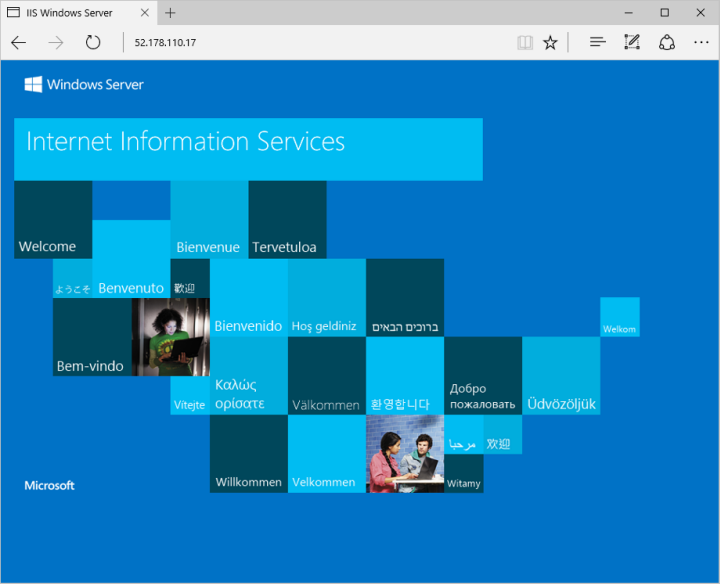

# <a name="create-a-windows-virtual-machine-with-hello-azure-cli"></a><span data-ttu-id="fd528-103">Crear una máquina virtual de Windows con hello CLI de Azure</span><span class="sxs-lookup"><span data-stu-id="fd528-103">Create a Windows virtual machine with hello Azure CLI</span></span>

<span data-ttu-id="fd528-104">Hola CLI de Azure es toocreate usado y administrar recursos de Azure desde la línea de comandos de Hola o en scripts.</span><span class="sxs-lookup"><span data-stu-id="fd528-104">hello Azure CLI is used toocreate and manage Azure resources from hello command line or in scripts.</span></span> <span data-ttu-id="fd528-105">Esta guía se detalla con hello Azure CLI toodeploy una máquina virtual ejecuta Windows Server 2016.</span><span class="sxs-lookup"><span data-stu-id="fd528-105">This guide details using hello Azure CLI toodeploy a virtual machine running Windows Server 2016.</span></span> <span data-ttu-id="fd528-106">Una vez completada la implementación, se conecte toohello servidor e instale IIS.</span><span class="sxs-lookup"><span data-stu-id="fd528-106">Once deployment is complete, we connect toohello server and install IIS.</span></span>

<span data-ttu-id="fd528-107">Si no tiene una suscripción a Azure, cree una [cuenta gratuita](https://azure.microsoft.com/free/?WT.mc_id=A261C142F) antes de empezar.</span><span class="sxs-lookup"><span data-stu-id="fd528-107">If you don't have an Azure subscription, create a [free account](https://azure.microsoft.com/free/?WT.mc_id=A261C142F) before you begin.</span></span>


[!INCLUDE [cloud-shell-try-it.md](../../../includes/cloud-shell-try-it.md)]

<span data-ttu-id="fd528-108">Si elige tooinstall y usar hello CLI localmente, este tutorial rápido requiere que se ejecuta la versión de CLI de Azure de hello 2.0.4 o versiones posteriores.</span><span class="sxs-lookup"><span data-stu-id="fd528-108">If you choose tooinstall and use hello CLI locally, this quickstart requires that you are running hello Azure CLI version 2.0.4 or later.</span></span> <span data-ttu-id="fd528-109">Ejecutar `az --version` toofind versión de Hola.</span><span class="sxs-lookup"><span data-stu-id="fd528-109">Run `az --version` toofind hello version.</span></span> <span data-ttu-id="fd528-110">Si necesita tooinstall o una actualización, consulte [instalar Azure CLI 2.0]( /cli/azure/install-azure-cli).</span><span class="sxs-lookup"><span data-stu-id="fd528-110">If you need tooinstall or upgrade, see [Install Azure CLI 2.0]( /cli/azure/install-azure-cli).</span></span> 


## <a name="create-a-resource-group"></a><span data-ttu-id="fd528-111">Crear un grupo de recursos</span><span class="sxs-lookup"><span data-stu-id="fd528-111">Create a resource group</span></span>

<span data-ttu-id="fd528-112">Cree un grupo de recursos con [az group create](/cli/azure/group#create).</span><span class="sxs-lookup"><span data-stu-id="fd528-112">Create a resource group with [az group create](/cli/azure/group#create).</span></span> <span data-ttu-id="fd528-113">Un grupo de recursos de Azure es un contenedor lógico en el que se implementan y se administran los recursos de Azure.</span><span class="sxs-lookup"><span data-stu-id="fd528-113">An Azure resource group is a logical container into which Azure resources are deployed and managed.</span></span> 

<span data-ttu-id="fd528-114">Hello en el ejemplo siguiente se crea un grupo de recursos denominado *myResourceGroup* en hello *eastus* ubicación.</span><span class="sxs-lookup"><span data-stu-id="fd528-114">hello following example creates a resource group named *myResourceGroup* in hello *eastus* location.</span></span>

```azurecli-interactive 
az group create --name myResourceGroup --location eastus
```

## <a name="create-virtual-machine"></a><span data-ttu-id="fd528-115">Create virtual machine</span><span class="sxs-lookup"><span data-stu-id="fd528-115">Create virtual machine</span></span>

<span data-ttu-id="fd528-116">Cree la máquina virtual con [az vm create](/cli/azure/vm#create).</span><span class="sxs-lookup"><span data-stu-id="fd528-116">Create a VM with [az vm create](/cli/azure/vm#create).</span></span> 

<span data-ttu-id="fd528-117">Hello en el ejemplo siguiente se crea una máquina virtual denominada *myVM*.</span><span class="sxs-lookup"><span data-stu-id="fd528-117">hello following example creates a VM named *myVM*.</span></span> <span data-ttu-id="fd528-118">Este ejemplo se utiliza *azureuser* para un nombre de usuario administrativo y *myPassword12* como contraseña de Hola.</span><span class="sxs-lookup"><span data-stu-id="fd528-118">This example uses *azureuser* for an administrative user name and *myPassword12* as hello password.</span></span> <span data-ttu-id="fd528-119">Actualice estos entorno de valores toosomething tooyour adecuado.</span><span class="sxs-lookup"><span data-stu-id="fd528-119">Update these values toosomething appropriate tooyour environment.</span></span> <span data-ttu-id="fd528-120">Estos valores son necesarios cuando se crea una conexión con la máquina virtual de Hola.</span><span class="sxs-lookup"><span data-stu-id="fd528-120">These values are needed when creating a connection with hello virtual machine.</span></span>

```azurecli-interactive 
az vm create --resource-group myResourceGroup --name myVM --image win2016datacenter --admin-username azureuser --admin-password myPassword12
```

<span data-ttu-id="fd528-121">Cuando se ha creado la VM de hello, Hola CLI de Azure muestra información toohello similar siguiente ejemplo.</span><span class="sxs-lookup"><span data-stu-id="fd528-121">When hello VM has been created, hello Azure CLI shows information similar toohello following example.</span></span> <span data-ttu-id="fd528-122">Tome nota de hello `publicIpAaddress`.</span><span class="sxs-lookup"><span data-stu-id="fd528-122">Take note of hello `publicIpAaddress`.</span></span> <span data-ttu-id="fd528-123">Esta dirección es hello tooaccess usa máquinas virtuales.</span><span class="sxs-lookup"><span data-stu-id="fd528-123">This address is used tooaccess hello VM.</span></span>

```azurecli-interactive 
{
  "fqdns": "",
  "id": "/subscriptions/d5b9d4b7-6fc1-0000-0000-000000000000/resourceGroups/myResourceGroup/providers/Microsoft.Compute/virtualMachines/myVM",
  "location": "eastus",
  "macAddress": "00-0D-3A-23-9A-49",
  "powerState": "VM running",
  "privateIpAddress": "10.0.0.4",
  "publicIpAddress": "52.174.34.95",
  "resourceGroup": "myResourceGroup"
}
```

## <a name="open-port-80-for-web-traffic"></a><span data-ttu-id="fd528-124">Apertura del puerto 80 para el tráfico web</span><span class="sxs-lookup"><span data-stu-id="fd528-124">Open port 80 for web traffic</span></span> 

<span data-ttu-id="fd528-125">De forma predeterminada, solo las conexiones RDP se permiten en tooWindows las máquinas virtuales implementadas en Azure.</span><span class="sxs-lookup"><span data-stu-id="fd528-125">By default only RDP connections are allowed in tooWindows virtual machines deployed in Azure.</span></span> <span data-ttu-id="fd528-126">Si esta máquina virtual va toobe un servidor Web, deberá tooopen puerto 80 de hello Internet.</span><span class="sxs-lookup"><span data-stu-id="fd528-126">If this VM is going toobe a webserver, you need tooopen port 80 from hello Internet.</span></span> <span data-ttu-id="fd528-127">Hola de uso [az de vm abrir puerto](/cli/azure/vm#open-port) comando tooopen hello deseado puerto.</span><span class="sxs-lookup"><span data-stu-id="fd528-127">Use hello [az vm open-port](/cli/azure/vm#open-port) command tooopen hello desired port.</span></span>  
 
 ```azurecli-interactive  
az vm open-port --port 80 --resource-group myResourceGroup --name myVM
```


## <a name="connect-toovirtual-machine"></a><span data-ttu-id="fd528-128">Conectar máquina toovirtual</span><span class="sxs-lookup"><span data-stu-id="fd528-128">Connect toovirtual machine</span></span>

<span data-ttu-id="fd528-129">Siguiente Hola de uso del comando toocreate una sesión de escritorio remoto con la máquina virtual de Hola.</span><span class="sxs-lookup"><span data-stu-id="fd528-129">Use hello following command toocreate a remote desktop session with hello virtual machine.</span></span> <span data-ttu-id="fd528-130">Reemplace la dirección IP de Hola por dirección IP pública de saludo de la máquina virtual.</span><span class="sxs-lookup"><span data-stu-id="fd528-130">Replace hello IP address with hello public IP address of your virtual machine.</span></span> <span data-ttu-id="fd528-131">Cuando se le solicite, escriba credenciales de hello usadas al crear la máquina virtual de Hola.</span><span class="sxs-lookup"><span data-stu-id="fd528-131">When prompted, enter hello credentials used when creating hello virtual machine.</span></span>

```bash 
mstsc /v:<Public IP Address>
```

## <a name="install-iis-using-powershell"></a><span data-ttu-id="fd528-132">Instalación de IIS mediante PowerShell</span><span class="sxs-lookup"><span data-stu-id="fd528-132">Install IIS using PowerShell</span></span>

<span data-ttu-id="fd528-133">Ahora que ha iniciado en toohello máquina virtual de Azure, puede usar una sola línea de PowerShell tooinstall IIS y permitir el tráfico de web de tooallow de regla de hello firewall local.</span><span class="sxs-lookup"><span data-stu-id="fd528-133">Now that you have logged in toohello Azure VM, you can use a single line of PowerShell tooinstall IIS and enable hello local firewall rule tooallow web traffic.</span></span> <span data-ttu-id="fd528-134">Abra un símbolo del sistema de PowerShell y ejecute el siguiente comando de hello:</span><span class="sxs-lookup"><span data-stu-id="fd528-134">Open a PowerShell prompt and run hello following command:</span></span>

```powershell
Install-WindowsFeature -name Web-Server -IncludeManagementTools
```

## <a name="view-hello-iis-welcome-page"></a><span data-ttu-id="fd528-135">Hola de vista Página de bienvenida de IIS</span><span class="sxs-lookup"><span data-stu-id="fd528-135">View hello IIS welcome page</span></span>

<span data-ttu-id="fd528-136">Con IIS instalado y el puerto 80 ahora abierta en la máquina virtual de hello Internet, puede usar un explorador web de la página de bienvenida de IIS de elección tooview Hola predeterminado.</span><span class="sxs-lookup"><span data-stu-id="fd528-136">With IIS installed and port 80 now open on your VM from hello Internet, you can use a web browser of your choice tooview hello default IIS welcome page.</span></span> <span data-ttu-id="fd528-137">Ser seguro toouse Hola dirección IP pública que documentó anteriormente página predeterminada de toovisit Hola.</span><span class="sxs-lookup"><span data-stu-id="fd528-137">Be sure toouse hello public IP address you documented above toovisit hello default page.</span></span> 

 

## <a name="clean-up-resources"></a><span data-ttu-id="fd528-139">Limpieza de recursos</span><span class="sxs-lookup"><span data-stu-id="fd528-139">Clean up resources</span></span>

<span data-ttu-id="fd528-140">Cuando ya no necesite, puede usar hello [eliminación del grupo az](/cli/azure/group#delete) comandos tooremove grupo de recursos de hello, VM y todos ellos relacionados con recursos.</span><span class="sxs-lookup"><span data-stu-id="fd528-140">When no longer needed, you can use hello [az group delete](/cli/azure/group#delete) command tooremove hello resource group, VM, and all related resources.</span></span>

```azurecli-interactive 
az group delete --name myResourceGroup
```

## <a name="next-steps"></a><span data-ttu-id="fd528-141">Pasos siguientes</span><span class="sxs-lookup"><span data-stu-id="fd528-141">Next steps</span></span>

<span data-ttu-id="fd528-142">En esta guía de inicio rápido, ha implementado una máquina virtual simple y una regla de grupo de seguridad de red, y ha instalado un servidor web.</span><span class="sxs-lookup"><span data-stu-id="fd528-142">In this quick start, you’ve deployed a simple virtual machine, a network security group rule, and installed a web server.</span></span> <span data-ttu-id="fd528-143">toolearn más información acerca de máquinas virtuales de Azure, continuar con tutorial toohello para máquinas virtuales de Windows.</span><span class="sxs-lookup"><span data-stu-id="fd528-143">toolearn more about Azure virtual machines, continue toohello tutorial for Windows VMs.</span></span>

> [!div class="nextstepaction"]
> [<span data-ttu-id="fd528-144">Tutoriales de máquinas virtuales Windows de Azure</span><span class="sxs-lookup"><span data-stu-id="fd528-144">Azure Windows virtual machine tutorials</span></span>](./tutorial-manage-vm.md)
