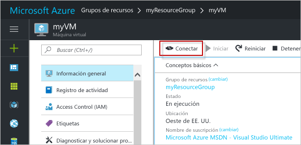

# <a name="create-a-windows-virtual-machine-with-the-azure-portal"></a><span data-ttu-id="0ba93-103">Cree una máquina virtual Windows en Azure Portal.</span><span class="sxs-lookup"><span data-stu-id="0ba93-103">Create a Windows virtual machine with the Azure portal</span></span>

<span data-ttu-id="0ba93-104">Las máquinas virtuales de Azure pueden crearse a través de Azure Portal.</span><span class="sxs-lookup"><span data-stu-id="0ba93-104">Azure virtual machines can be created through the Azure portal.</span></span> <span data-ttu-id="0ba93-105">Este método proporciona una interfaz de usuario basada en el explorador para crear y configurar máquinas virtuales y todos los recursos asociados.</span><span class="sxs-lookup"><span data-stu-id="0ba93-105">This method provides a browser-based user interface for creating and configuring virtual machines and all related resources.</span></span> <span data-ttu-id="0ba93-106">Esta guía de inicio rápido le lleva paso a paso por la creación de una máquina virtual y la instalación de un servidor web en ella.</span><span class="sxs-lookup"><span data-stu-id="0ba93-106">This Quickstart steps through creating a virtual machine and installing a webserver on the VM.</span></span>

<span data-ttu-id="0ba93-107">Si no tiene una suscripción a Azure, cree una [cuenta gratuita](https://azure.microsoft.com/free/?WT.mc_id=A261C142F) antes de empezar.</span><span class="sxs-lookup"><span data-stu-id="0ba93-107">If you don't have an Azure subscription, create a [free account](https://azure.microsoft.com/free/?WT.mc_id=A261C142F) before you begin.</span></span>

## <a name="log-in-to-azure"></a><span data-ttu-id="0ba93-108">Inicie sesión en Azure.</span><span class="sxs-lookup"><span data-stu-id="0ba93-108">Log in to Azure</span></span>

<span data-ttu-id="0ba93-109">Inicie sesión en Azure Portal: http://portal.azure.com/.</span><span class="sxs-lookup"><span data-stu-id="0ba93-109">Log in to the Azure portal at http://portal.azure.com.</span></span>

## <a name="create-virtual-machine"></a><span data-ttu-id="0ba93-110">Create virtual machine</span><span class="sxs-lookup"><span data-stu-id="0ba93-110">Create virtual machine</span></span>

1. <span data-ttu-id="0ba93-111">Haga clic en el botón **Nuevo** de la esquina superior izquierda de Azure Portal.</span><span class="sxs-lookup"><span data-stu-id="0ba93-111">Click the **New** button found on the upper left-hand corner of the Azure portal.</span></span>

2. <span data-ttu-id="0ba93-112">Seleccione **Compute**y, después, seleccione **Windows Server 2016 Datacenter**.</span><span class="sxs-lookup"><span data-stu-id="0ba93-112">Select **Compute**, and then select **Windows Server 2016 Datacenter**.</span></span> 

3. <span data-ttu-id="0ba93-113">Escriba la información de la máquina virtual.</span><span class="sxs-lookup"><span data-stu-id="0ba93-113">Enter the virtual machine information.</span></span> <span data-ttu-id="0ba93-114">El nombre de usuario y la contraseña que especifique aquí se usarán para iniciar sesión en la máquina virtual.</span><span class="sxs-lookup"><span data-stu-id="0ba93-114">The user name and password entered here is used to log in to the virtual machine.</span></span> <span data-ttu-id="0ba93-115">Cuando haya terminado, haga clic en **Aceptar**.</span><span class="sxs-lookup"><span data-stu-id="0ba93-115">When complete, click **OK**.</span></span>

      

4. <span data-ttu-id="0ba93-117">Seleccione un tamaño para la máquina virtual.</span><span class="sxs-lookup"><span data-stu-id="0ba93-117">Select a size for the VM.</span></span> <span data-ttu-id="0ba93-118">Para ver más tamaños, seleccione **Ver todo** o cambie el filtro **Supported disk type** (Tipo de disco admitido).</span><span class="sxs-lookup"><span data-stu-id="0ba93-118">To see more sizes, select **View all** or change the **Supported disk type** filter.</span></span> 

      

5. <span data-ttu-id="0ba93-120">En la hoja de configuración, conserve los valores predeterminados y haga clic en **Aceptar**.</span><span class="sxs-lookup"><span data-stu-id="0ba93-120">On the settings blade, keep the defaults and click **OK**.</span></span>

6. <span data-ttu-id="0ba93-121">En la página Resumen, haga clic en **Aceptar** para iniciar la implementación de máquina virtual.</span><span class="sxs-lookup"><span data-stu-id="0ba93-121">On the summary page, click **Ok** to start the virtual machine deployment.</span></span>

7. <span data-ttu-id="0ba93-122">La máquina virtual se anclará al panel de Azure Portal.</span><span class="sxs-lookup"><span data-stu-id="0ba93-122">The VM will be pinned to the Azure portal dashboard.</span></span> <span data-ttu-id="0ba93-123">Una vez completada la implementación, se abrirá automáticamente la hoja de resumen de la máquina virtual.</span><span class="sxs-lookup"><span data-stu-id="0ba93-123">Once the deployment has completed, the VM summary blade automatically opens.</span></span>


## <a name="connect-to-virtual-machine"></a><span data-ttu-id="0ba93-124">Conexión a la máquina virtual</span><span class="sxs-lookup"><span data-stu-id="0ba93-124">Connect to virtual machine</span></span>

<span data-ttu-id="0ba93-125">Cree una conexión a Escritorio remoto en la máquina virtual.</span><span class="sxs-lookup"><span data-stu-id="0ba93-125">Create a remote desktop connection to the virtual machine.</span></span>

1. <span data-ttu-id="0ba93-126">Haga clic en el botón **Conectar** en las propiedades de la máquina virtual.</span><span class="sxs-lookup"><span data-stu-id="0ba93-126">Click the **Connect** button on the virtual machine properties.</span></span> <span data-ttu-id="0ba93-127">Se crea y se descarga un archivo de Protocolo de Escritorio remoto (archivo .rdp).</span><span class="sxs-lookup"><span data-stu-id="0ba93-127">A Remote Desktop Protocol file (.rdp file) is created and downloaded.</span></span>

     

2. <span data-ttu-id="0ba93-129">Para conectarse a la máquina virtual, abra el archivo RDP descargado.</span><span class="sxs-lookup"><span data-stu-id="0ba93-129">To connect to your VM, open the downloaded RDP file.</span></span> <span data-ttu-id="0ba93-130">Cuando se le solicite, haga clic en **Conectar**.</span><span class="sxs-lookup"><span data-stu-id="0ba93-130">If prompted, click **Connect**.</span></span> <span data-ttu-id="0ba93-131">En un equipo Mac, necesita un cliente RDP como este [Cliente de Escritorio remoto](https://itunes.apple.com/us/app/microsoft-remote-desktop/id715768417?mt=12) de Mac App Store.</span><span class="sxs-lookup"><span data-stu-id="0ba93-131">On a Mac, you need an RDP client such as this [Remote Desktop Client](https://itunes.apple.com/us/app/microsoft-remote-desktop/id715768417?mt=12) from the Mac App Store.</span></span>

3. <span data-ttu-id="0ba93-132">Escriba el nombre de usuario y la contraseña que especificó al crear la máquina virtual y, a continuación, haga clic en **Aceptar**.</span><span class="sxs-lookup"><span data-stu-id="0ba93-132">Enter the user name and password you specified when creating the virtual machine, then click **Ok**.</span></span>

4. <span data-ttu-id="0ba93-133">Puede recibir una advertencia de certificado durante el proceso de inicio de sesión.</span><span class="sxs-lookup"><span data-stu-id="0ba93-133">You may receive a certificate warning during the sign-in process.</span></span> <span data-ttu-id="0ba93-134">Haga clic en **Sí** o **Conectar** para continuar con la conexión.</span><span class="sxs-lookup"><span data-stu-id="0ba93-134">Click **Yes** or **Continue** to proceed with the connection.</span></span>


## <a name="install-iis-using-powershell"></a><span data-ttu-id="0ba93-135">Instalación de IIS mediante PowerShell</span><span class="sxs-lookup"><span data-stu-id="0ba93-135">Install IIS using PowerShell</span></span>

<span data-ttu-id="0ba93-136">En la máquina virtual, inicie una sesión de PowerShell y ejecute el siguiente comando para instalar IIS.</span><span class="sxs-lookup"><span data-stu-id="0ba93-136">On the virtual machine, start a PowerShell session and run the following command to install IIS.</span></span>

```powershell
Install-WindowsFeature -name Web-Server -IncludeManagementTools
```

<span data-ttu-id="0ba93-137">Cuando haya finalizado, salga de la sesión de RDP y vuelva a las propiedades de la máquina virtual de Azure Portal.</span><span class="sxs-lookup"><span data-stu-id="0ba93-137">When done, exit the RDP session and return the VM properties in the Azure portal.</span></span>

## <a name="open-port-80-for-web-traffic"></a><span data-ttu-id="0ba93-138">Apertura del puerto 80 para el tráfico web</span><span class="sxs-lookup"><span data-stu-id="0ba93-138">Open port 80 for web traffic</span></span> 

<span data-ttu-id="0ba93-139">Los grupos de seguridad de red (NSG) protegen el tráfico entrante y saliente.</span><span class="sxs-lookup"><span data-stu-id="0ba93-139">A Network security group (NSG) secures inbound and outbound traffic.</span></span> <span data-ttu-id="0ba93-140">Cuando se crea una máquina virtual desde Azure Portal, se crea una regla de entrada en el puerto 3389 para las conexiones RDP.</span><span class="sxs-lookup"><span data-stu-id="0ba93-140">When a VM is created from the Azure portal, an inbound rule is created on port 3389 for RDP connections.</span></span> <span data-ttu-id="0ba93-141">Dado que esta máquina virtual hospeda un servidor web, es preciso crear una regla de NSG para el puerto 80.</span><span class="sxs-lookup"><span data-stu-id="0ba93-141">Because this VM hosts a webserver, an NSG rule needs to be created for port 80.</span></span>

1. <span data-ttu-id="0ba93-142">En la máquina virtual, haga clic en el nombre del **grupo de recursos**.</span><span class="sxs-lookup"><span data-stu-id="0ba93-142">On the virtual machine, click the name of the **Resource group**.</span></span>
2. <span data-ttu-id="0ba93-143">Seleccione el **grupo de seguridad de red**.</span><span class="sxs-lookup"><span data-stu-id="0ba93-143">Select the **network security group**.</span></span> <span data-ttu-id="0ba93-144">Los NSG pueden identificarse mediante la columna **Tipo**.</span><span class="sxs-lookup"><span data-stu-id="0ba93-144">The NSG can be identified using the **Type** column.</span></span> 
3. <span data-ttu-id="0ba93-145">En el menú de la izquierda, en Configuración, haga clic en **Reglas de seguridad de entrada**.</span><span class="sxs-lookup"><span data-stu-id="0ba93-145">On the left-hand menu, under settings, click **Inbound security rules**.</span></span>
4. <span data-ttu-id="0ba93-146">Haga clic en **Agregar**.</span><span class="sxs-lookup"><span data-stu-id="0ba93-146">Click on **Add**.</span></span>
5. <span data-ttu-id="0ba93-147">En **Nombre**, escriba **http**.</span><span class="sxs-lookup"><span data-stu-id="0ba93-147">In **Name**, type **http**.</span></span> <span data-ttu-id="0ba93-148">Asegúrese de que **Intervalo de puertos** esté establecido en 80 y **Acción** esté establecido en **Permitir**.</span><span class="sxs-lookup"><span data-stu-id="0ba93-148">Make sure **Port range** is set to 80 and **Action** is set to **Allow**.</span></span> 
6. <span data-ttu-id="0ba93-149">Haga clic en **Aceptar**.</span><span class="sxs-lookup"><span data-stu-id="0ba93-149">Click **OK**.</span></span>


## <a name="view-the-iis-welcome-page"></a><span data-ttu-id="0ba93-150">Página principal de IIS</span><span class="sxs-lookup"><span data-stu-id="0ba93-150">View the IIS welcome page</span></span>

<span data-ttu-id="0ba93-151">Con IIS instalado y el puerto 80 abierto para la máquina virtual, se puede acceder ahora al servidor web desde Internet.</span><span class="sxs-lookup"><span data-stu-id="0ba93-151">With IIS installed, and port 80 open to your VM, the webserver can now be accessed from the internet.</span></span> <span data-ttu-id="0ba93-152">Abra un explorador web y escriba la dirección IP pública de la máquina virtual.</span><span class="sxs-lookup"><span data-stu-id="0ba93-152">Open a web browser, and enter the public IP address of the VM.</span></span> <span data-ttu-id="0ba93-153">La dirección IP pública puede encontrarse en la hoja de la máquina virtual en Azure Portal.</span><span class="sxs-lookup"><span data-stu-id="0ba93-153">the public IP address can be found on the VM blade in the Azure portal.</span></span>

 

## <a name="clean-up-resources"></a><span data-ttu-id="0ba93-155">Limpieza de recursos</span><span class="sxs-lookup"><span data-stu-id="0ba93-155">Clean up resources</span></span>

<span data-ttu-id="0ba93-156">Cuando ya no los necesite, elimine el grupo de recursos, la máquina virtual y todos los recursos relacionados.</span><span class="sxs-lookup"><span data-stu-id="0ba93-156">When no longer needed, delete the resource group, virtual machine, and all related resources.</span></span> <span data-ttu-id="0ba93-157">Para ello, seleccione el grupo de recursos de la hoja de la máquina virtual y haga clic en **Eliminar**.</span><span class="sxs-lookup"><span data-stu-id="0ba93-157">To do so, select the resource group from the virtual machine blade and click **Delete**.</span></span>

## <a name="next-steps"></a><span data-ttu-id="0ba93-158">Pasos siguientes</span><span class="sxs-lookup"><span data-stu-id="0ba93-158">Next steps</span></span>

<span data-ttu-id="0ba93-159">En esta guía de inicio rápido, ha implementado una máquina virtual simple y una regla de grupo de seguridad de red, y ha instalado un servidor web.</span><span class="sxs-lookup"><span data-stu-id="0ba93-159">In this quick start, you’ve deployed a simple virtual machine, a network security group rule, and installed a web server.</span></span> <span data-ttu-id="0ba93-160">Para más información acerca de las máquinas virtuales de Azure, continúe con el tutorial de máquinas virtuales Windows.</span><span class="sxs-lookup"><span data-stu-id="0ba93-160">To learn more about Azure virtual machines, continue to the tutorial for Windows VMs.</span></span>

> [!div class="nextstepaction"]
> [<span data-ttu-id="0ba93-161">Tutoriales de máquinas virtuales Windows de Azure</span><span class="sxs-lookup"><span data-stu-id="0ba93-161">Azure Windows virtual machine tutorials</span></span>](./tutorial-manage-vm.md)
