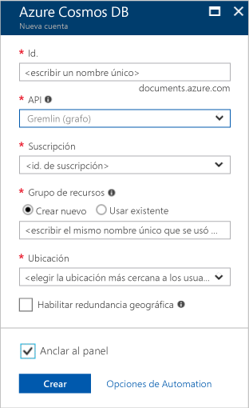

1. En una nueva ventana, inicie sesión en toohello [portal de Azure](https://portal.azure.com/).In a new window, sign in toohello [Azure portal](https://portal.azure.com/).
2. En el panel izquierdo de hello, haga clic en **New**, haga clic en **bases de datos**y, a continuación, en **base de datos de Azure Cosmos**, haga clic en **crear**.In hello left pane, click **New**, click **Databases**, and then under **Azure Cosmos DB**, click **Create**.
   
   

3. Hola **nueva cuenta** hoja, especificar configuración de Hola que desee para esta cuenta de base de datos de Azure Cosmos.In hello **New account** blade, specify hello configuration that you want for this Azure Cosmos DB account. 

    Con Azure Cosmos DB, puede elegir uno de cuatro modelos de programación: Gremlin (grafo), MongoDB, SQL (DocumentDB) y Table (clave-valor), cada uno de los cuales requiere actualmente una cuenta independiente.With Azure Cosmos DB, you can choose one of four programming models: Gremlin (graph), MongoDB, SQL (DocumentDB), and Table (key-value), each which currently require a separate account.
       
    En este artículo de inicio rápido, se programa contra Hola API Graph, elija **Gremlin (gráfico)** tal y como rellene el formulario de Hola.In this quick-start article, we program against hello Graph API, so choose **Gremlin (graph)** as you fill out hello form. Si tiene datos de documentos de una aplicación de catálogo, datos de clave/valor (tabla) o datos migrados desde una aplicación de MongoDB, debe tener en cuenta que la base de datos de Azure Cosmos puede proporcionar una plataforma de servicio de base de datos distribuida globalmente y de alta disponibilidad para todas las aplicaciones críticas.If you have document data from a catalog app, key/value (table) data, or data that's migrated from a MongoDB app, realize that Azure Cosmos DB can provide a highly available, globally distributed database service platform for all your mission-critical applications.

    Complete los campos de hello en hello **nueva cuenta** hoja, con la información de Hola Hola siguiente captura de pantalla como guía: los valores pueden ser diferentes de los valores de hello en captura de pantalla de Hola.Complete hello fields on hello **New account** blade, using hello information in hello following screenshot as a guide - your values may be different than hello values in hello screenshot.
 
    

    ConfiguraciónSetting|Valor sugeridoSuggested value|DescripciónDescription
    ---|---|---
    IDID|*Valor único**Unique value*|Un nombre único que identifica esta cuenta de Azure Cosmos DB.A unique name that identifies this Azure Cosmos DB account. Dado que *documents.azure.com* es toohello anexado ID que proporcione toocreate su URI, utilice un único pero identificación Id.Because *documents.azure.com* is appended toohello ID that you provide toocreate your URI, use a unique but identifiable ID. Id. de Hello debe contener solo letras minúsculas, números y caracteres de guión (-) de Hola y debe contener de 3 caracteres too50.hello ID must contain only lowercase letters, numbers, and hello hyphen (-) character, and it must contain from 3 too50 characters.
    APIAPI|Gremlin (graph)Gremlin (graph)|Se programa contra Hola [API Graph](../articles/cosmos-db/graph-introduction.md) más adelante en este artículo.We program against hello [Graph API](../articles/cosmos-db/graph-introduction.md) later in this article.|
    La suscripciónSubscription|*Su suscripción**Your subscription*|Hola suscripción de Azure que desea toouse para esta cuenta de base de datos de Azure Cosmos.hello Azure subscription that you want toouse for this Azure Cosmos DB account. 
    Grupo de recursosResource Group|*Hola mismo valor que el Id.**hello same value as ID*|Hola nuevo recurso nombre de grupo para su cuenta.hello new resource group name for your account. Para simplificar, puede usar Hola mismo nombre como su identificador.For simplicity, you can use hello same name as your ID. 
    UbicaciónLocation|*usuarios de Hello región más cercanos tooyour**hello region closest tooyour users*|Hola ubicación geográfica en la que toohost su cuenta de base de datos de Azure Cosmos.hello geographic location in which toohost your Azure Cosmos DB account. Elegir ubicación de hello más cercanos usuarios tooyour toogive ellos Hola toohello más rápido acceso a los datos.Choose hello location closest tooyour users toogive them hello fastest access toohello data.

4. Haga clic en **crear** cuenta de hello toocreate.Click **Create** toocreate hello account.
5. En la barra de herramientas superior hello, haga clic en hello **notificaciones** icono  proceso de implementación de toomonitor Hola.On hello top toolbar, click hello **Notifications** icon  toomonitor hello deployment process.

    

6.  Cuando la ventana de notificaciones de hello indica ventana de notificación de hello implementación Hola se ha realizado correctamente, cierre y abra Hola nueva cuenta de hello **todos los recursos** icono Hola panel.When hello Notifications window indicates hello deployment succeeded, close hello notification window and open hello new account from hello **All Resources** tile on hello Dashboard. 

    
