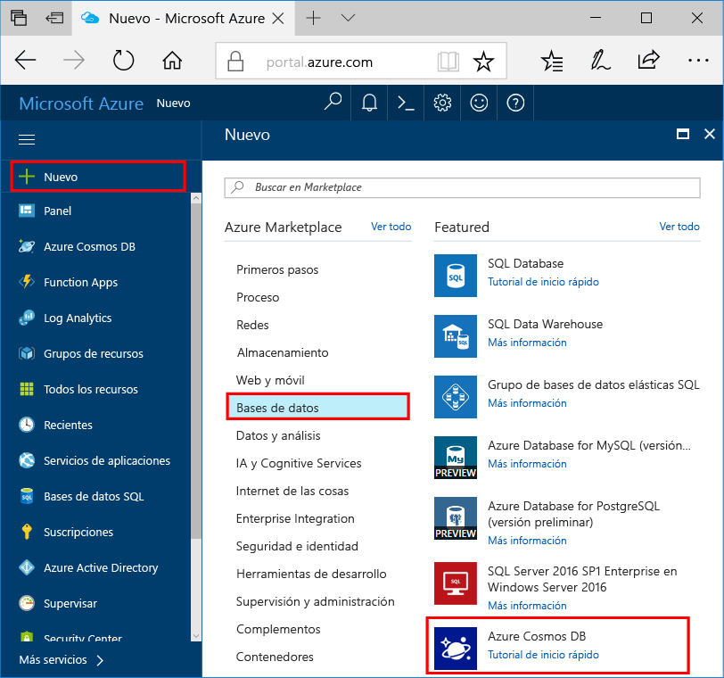

1. En una nueva ventana, inicie sesión en toohello [portal de Azure](https://portal.azure.com/).In a new window, sign in toohello [Azure portal](https://portal.azure.com/).
2. En el menú de la izquierda hello, haga clic en **New**, haga clic en **bases de datos**y, a continuación, en **base de datos de Azure Cosmos**, haga clic en **crear**.In hello left menu, click **New**, click **Databases**, and then under **Azure Cosmos DB**, click **Create**.
   
   

3. Hola **nueva cuenta** hoja, especifican la configuración deseada de Hola para hello cuenta de base de datos de Azure Cosmos.In hello **New account** blade, specify hello desired configuration for hello Azure Cosmos DB account. 

    Con Azure Cosmos DB, puede elegir uno de cuatro modelos de programación: Gremlin (grafo), MongoDB, SQL (DocumentDB) y Table (clave-valor).With Azure Cosmos DB, you can choose one of four programming models: Gremlin (graph), MongoDB, SQL (DocumentDB), and Table (key-value). 
    
    En esta guía de inicio rápido se deberá estar programando con hello API de tabla por lo que podrá elegir **tabla (clave-valor)** tal y como rellene el formulario de Hola.In this quick start we'll be programming against hello Table API so you'll choose **Table (key-value)** as you fill out hello form. Pero si tiene datos de grafos para una aplicación de redes sociales, datos de documentos de una aplicación de catálogo o datos migrados desde una aplicación de MongoDB, debe tener en cuenta que Azure Cosmos DB puede proporcionar una plataforma de servicio de base de datos distribuida globalmente y de alta disponibilidad para todas las aplicaciones críticas.But if you have graph data for a social media app, document data from a catalog app, or data migrated from a MongoDB app, realize that Azure Cosmos DB can provide a highly available, globally-distributed database service platform for all your mission-critical applications.

    Rellene la nueva hoja de cuenta Hola con información de Hola de captura de pantalla de hello como guía.Fill out hello New account blade using hello information in hello screenshot as a guide. Puede elegir valores únicos que configure su cuenta, por lo que sus valores no coincidan exactamente Hola captura de pantalla.You will choose unique values as you set up your account so your values will not match hello screenshot exactly. 
 
    

    ConfiguraciónSetting|Valor sugeridoSuggested value|DescripciónDescription
    ---|---|---
    IDID|*Valor único**Unique value*|Un nombre único elegir cuenta de base de datos de Azure Cosmos hello tooidentify.A unique name you choose tooidentify hello Azure Cosmos DB account. *Documents.Azure.com* es Id. de toohello anexado proporcione toocreate su URI, por lo que usar un identificador único pero identificable.*documents.azure.com* is appended toohello ID you provide toocreate your URI, so use a unique but identifiable ID. Id. de Hello puede contener solo letras minúsculas, números y hello '-' caracteres y debe tener entre 3 y 50 caracteres.hello ID may contain only lowercase letters, numbers, and hello '-' character, and must be between 3 and 50 characters.
    APIAPI|Tabla (clave-valor)Table (key-value)|Se deberá estar programando con hello [API tabla](../articles/cosmos-db/table-introduction.md) más adelante en este artículo.We'll be programming against hello [Table API](../articles/cosmos-db/table-introduction.md) later in this article.|
    La suscripciónSubscription|*Su suscripción**Your subscription*|Hola suscripción de Azure que quiere toouse de cuenta de base de datos de Azure Cosmos Hola.hello Azure subscription that you want toouse for hello Azure Cosmos DB account. 
    Grupo de recursosResource Group|*Hola mismo valor que el Id.**hello same value as ID*|Hola nuevo recurso nombre de grupo para su cuenta.hello new resource group name for your account. Para simplificar, puede usar Hola mismo nombre como su identificador.For simplicity, you can use hello same name as your ID. 
    UbicaciónLocation|*usuarios de Hello región más cercanos tooyour**hello region closest tooyour users*|Hola ubicación geográfica en la que toohost su cuenta de base de datos de Azure Cosmos.hello geographic location in which toohost your Azure Cosmos DB account. Elegir ubicación de hello más cercanos usuarios tooyour toogive ellos Hola toohello más rápido acceso a los datos.Choose hello location closest tooyour users toogive them hello fastest access toohello data.   

4. Haga clic en **crear** cuenta de hello toocreate.Click **Create** toocreate hello account.
5. En la barra de herramientas de hello, haga clic en **notificaciones** toomonitor proceso de implementación de Hola.On hello toolbar, click **Notifications** toomonitor hello deployment process.

    

6.  Una vez completada la implementación de hello, nueva cuenta de hello abierto de hello todos los recursos en mosaico.When hello deployment is complete, open hello new account from hello All Resources tile. 

    
