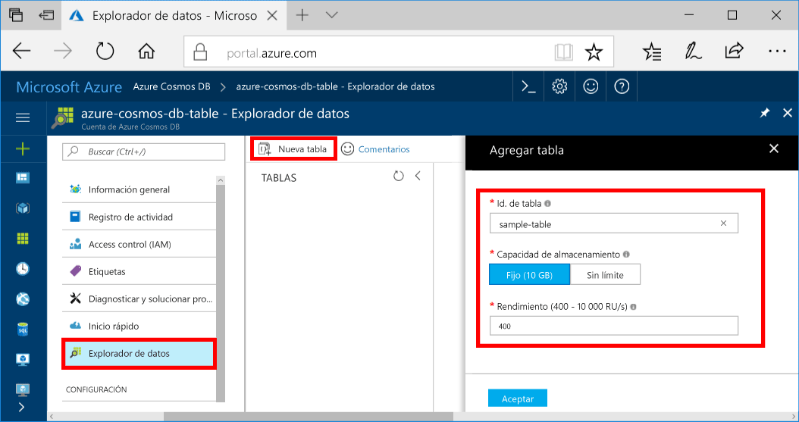

Ahora puede usar el Explorador de datos toocreate una tabla y agregar base de datos de tooyour de datos.You can now use Data Explorer toocreate a table and add data tooyour database. 

1. Hola portal de Azure, en el menú de navegación de hello, haga clic en **Explorador de datos (vista previa)**.In hello Azure portal, in hello navigation menu, click **Data Explorer (Preview)**. 
2. En la hoja de hello Explorador de datos, haga clic en **nueva tabla**, a continuación, rellene la página de hello mediante Hola siguiente información.In hello Data Explorer blade, click **New Table**, then fill in hello page using hello following information.

    

    ConfiguraciónSetting|Valor sugeridoSuggested value|DescripciónDescription
    ---|---|---
    Id. de tablaTable Id|sample-tablesample-table|Id. de Hello para la nueva tabla.hello ID for your new table. Los nombres de tabla tienen Hola mismo carácter requisitos como identificadores de base de datos.Table names have hello same character requirements as database ids. Los nombres de bases de datos deben tener entre 1 y 255 caracteres y no pueden contener `/ \ # ?` o un espacio al final.Database names must be between 1 and 255 characters, and cannot contain `/ \ # ?` or a trailing space.
    Capacidad de almacenamientoStorage capacity| 10 GB10 GB|Deje el valor predeterminado de Hola.Leave hello default value. Se trata de capacidad de almacenamiento de Hola de base de datos de Hola.This is hello storage capacity of hello database.
    RendimientoThroughput|400 RU400 RUs|Deje el valor predeterminado de Hola.Leave hello default value. Se puede escalar hello [rendimiento](../articles/cosmos-db/request-units.md) posterior si desea que la latencia tooreduce.You can scale up hello [throughput](../articles/cosmos-db/request-units.md) later if you want tooreduce latency.

3. Una vez que se rellena el formulario de hello, haga clic en **Aceptar**.Once hello form is filled out, click **OK**.
