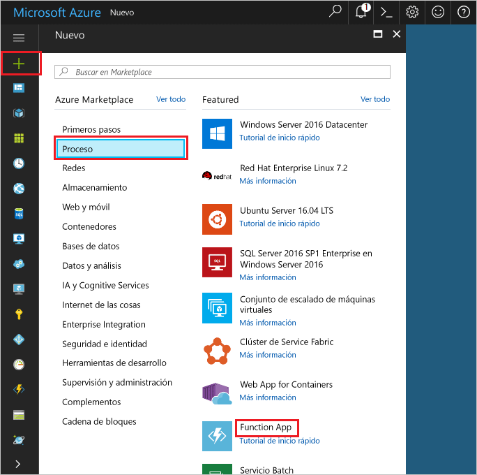

1. Haga clic en hello **New** encontró el botón en la esquina izquierda superior de Hola de hello portal de Azure.

1. Haga clic en **Proceso** > **Function App** y seleccione su **suscripción**. A continuación, utilice la configuración de la función aplicación Hola como se especifica en la tabla de Hola.

    

    | Configuración      | Valor sugerido  | Descripción                                        |
    | ------------ |  ------- | -------------------------------------------------- |
    | **Nombre de la aplicación** | Nombre único globalmente | Nombre que identifica la nueva Function App. | 
    | **[Grupo de recursos](../articles/azure-resource-manager/resource-group-overview.md)** |  myResourceGroup | Nombre para el nuevo grupo de recursos hello en qué toocreate a la aplicación de la función. | 
    | **[Plan de hospedaje](../articles/azure-functions/functions-scale.md)** |   Plan de consumo | Plan de hospedaje que define cómo se asignan los recursos tooyour función aplicación. En el valor predeterminado de hello **consumo previsto**, los recursos se agregan dinámicamente según sea necesario por las funciones. Solo paga por vez Hola que ejecutan sus funciones.   |
    | **Ubicación** | Europa occidental | Elija una ubicación cerca de usted o cerca de otros servicios a los que tendrán acceso las funciones. |
    | **[Cuenta de almacenamiento](../articles/storage/common/storage-create-storage-account.md#create-a-storage-account)** |  Nombre único globalmente |  Nombre de la nueva cuenta de almacenamiento Hola utilizado por la aplicación de la función. Los nombres de cuentas de almacenamiento deben tener entre 3 y 24 caracteres, y solo pueden contener números y letras minúsculas. También puede usar una cuenta existente. |

1. Haga clic en **crear** tooprovision e implementar la aplicación de hello nueva función.
