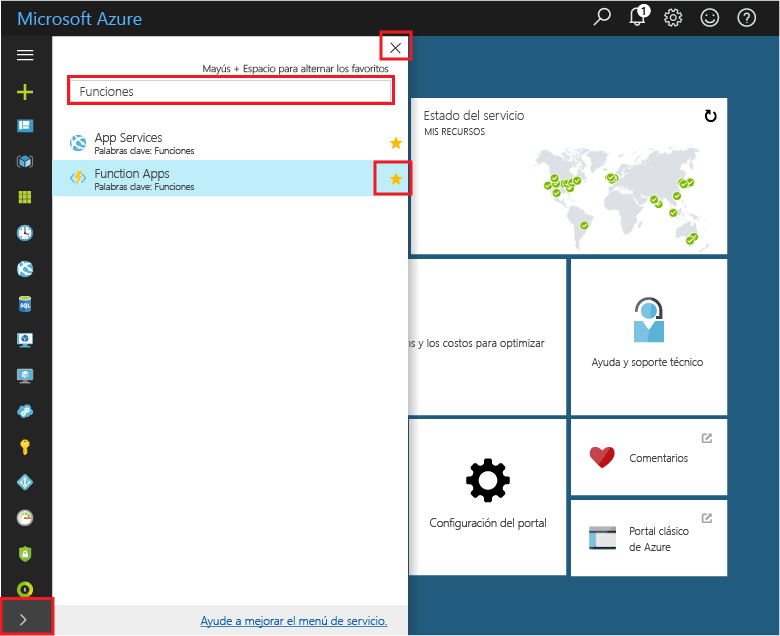
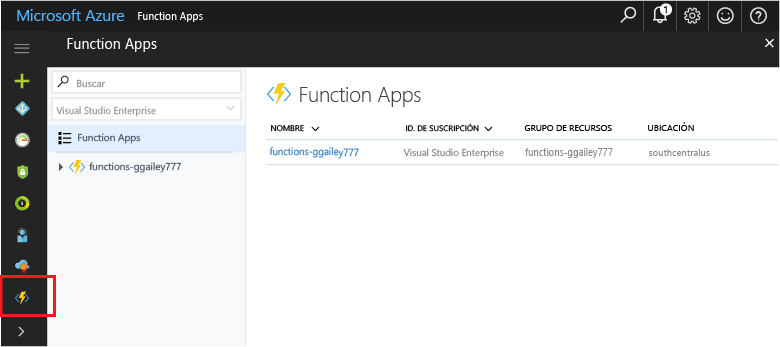

## Agregar aplicaciones de la función tooyour portales favoritos 

Si aún no lo ha hecho, agregue favoritos de aplicaciones de la función tooyour Hola portal de Azure. Esto hace más fácil toofind las aplicaciones de la función. Si ya ha hecho esto, omitir toohello próxima sección. 

1. Inicie sesión en toohello [portal de Azure](https://portal.azure.com/).

2. Haga clic en flecha hello en hello inferior izquierdo tooexpand todos los servicios, escriba `Functions` en hello **filtro** campo y, a continuación, haga clic en estrella de hello siguiente demasiado**aplicaciones de la función**.  
 
    

    Esto agrega menú de toohello del icono de hello funciones en izquierda de hello del portal de Hola.

3. Cerrar el menú de hello, a continuación, desplácese hacia abajo del icono de funciones de toohello inferior toosee Hola. Haga clic en este toosee icono una lista de todas las aplicaciones de la función. Haga clic en el toowork de aplicación de función con funciones de esta aplicación. 
 
    
 
     