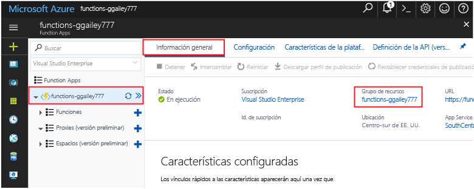

Otras guías de inicio rápido de esta colección se basan en los valores de esta.Other quick starts in this collection build upon this quick start. Si tiene previsto toocontinue toowork con guías rápidas posteriores o con los tutoriales de hello, no limpiar los recursos de hello creados en esta rápida se inician.If you plan toocontinue on toowork with subsequent quick starts or with hello tutorials, do not clean up hello resources created in this quick start. 

Si no tiene previsto toocontinue, haga clic en hello **grupo de recursos** para la aplicación de la función de Hola Hola portal y, a continuación, haga clic en **eliminar**.If you do not plan toocontinue, click hello **Resource group** for hello function app in hello portal, and then click **Delete**. 

