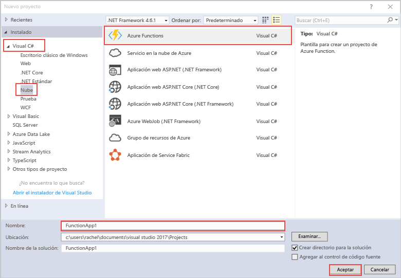

plantilla de proyecto de Hello las funciones de Azure en Visual Studio crea un proyecto que puede ser publicado tooa función aplicación en Azure.hello Azure Functions project template in Visual Studio creates a project that can be published tooa function app in Azure. Una Function App permite agrupar funciones como una unidad lógica para facilitar la administración, la implementación y el uso compartido de recursos.A function app lets you group functions as a logic unit for easier management, deployment, and sharing of resources.   

1. Haga clic derecho del ratón en el nodo del proyecto hello en **el Explorador de soluciones**, a continuación, elija **agregar** > **nuevo elemento**.Right mouse click on hello project node in **Solution Explorer**, then choose **Add** > **New Item**. Elija **Azure función** desde el cuadro de diálogo de Hola.Choose **Azure Function** from hello dialog box.

2. Hola **nuevo proyecto** cuadro de diálogo, expanda **Visual C#** > **nube** nodo, seleccione **funciones de Azure**, escriba un **Nombre** para el proyecto y haga clic en **Aceptar**.In hello **New Project** dialog, expand **Visual C#** > **Cloud** node, select **Azure Functions**, type a **Name** for your project, and click **OK**. nombre de la función aplicación Hola debe ser válido, como un espacio de nombres de C#, por lo que no use caracteres de subrayado, guiones o caracteres no alfanuméricos.hello function app name must be valid as a C# namespace, so don't use underscores, hyphens, or any other nonalphanumeric characters. 

    
