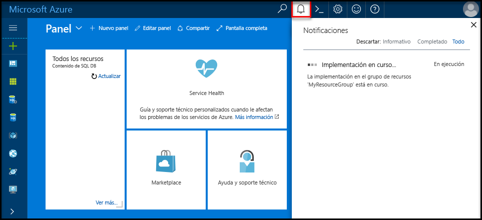
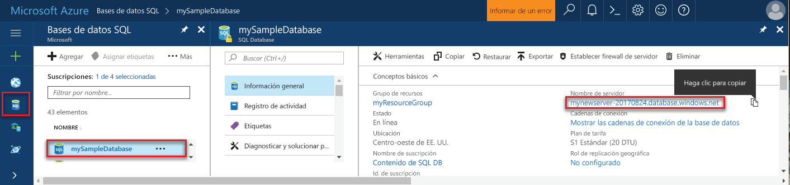
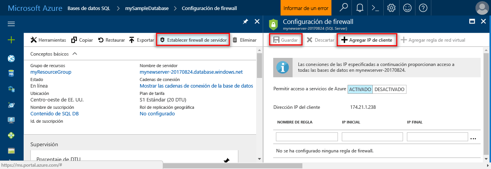

## Iniciar sesión en el portal de AzureLog in to the Azure portal

Inicie sesión en [Azure Portal](https://portal.azure.com/).Log in to the [Azure portal](https://portal.azure.com/).

## Creación de una base de datos SQL mediante Azure PortalCreate a blank SQL database using the Azure portal

Se crea una base de datos SQL de Azure con un conjunto definido de [recursos de proceso y almacenamiento](../articles/sql-database/sql-database-service-tiers.md).An Azure SQL database is created with a defined set of [compute and storage resources](../articles/sql-database/sql-database-service-tiers.md). La base de datos se crea dentro de un [grupo de recursos de Azure](../articles/azure-resource-manager/resource-group-overview.md) y en un [servidor lógico de Azure SQL Database](../articles/sql-database/sql-database-features.md).The database is created within an [Azure resource group](../articles/azure-resource-manager/resource-group-overview.md) and in an [Azure SQL Database logical server](../articles/sql-database/sql-database-features.md). 

Siga estos pasos para crear una instancia en blanco de SQL Database.Follow these steps to create a blank SQL database. 

1. Haga clic en el botón **Nuevo** de la esquina superior izquierda de Azure Portal.Click the **New** button found on the upper left-hand corner of the Azure portal.

2. En la página **Nuevo**, seleccione **Bases de datos** y, en la página **Bases de datos**, seleccione **SQL Database**.Select **Databases** from the **New** page, and select **SQL Database** from the **Databases** page. 

   

3. Rellene el formulario de SQL Database con la siguiente información, como se muestra en la imagen anterior:Fill out the SQL Database form with the following information, as shown on the preceding image:   

   | ConfiguraciónSetting | Valor sugeridoSuggested value | DescripciónDescription |
   | --------| --------------- | ----------- | 
   | **Nombre de la base de datos****Database name** | mySampleDatabasemySampleDatabase | Para conocer los nombres de base de datos válidos, consulte [Database Identifiers](https://docs.microsoft.com/sql/relational-databases/databases/database-identifiers) (Identificadores de base de datos).For valid database names, see [Database Identifiers](https://docs.microsoft.com/sql/relational-databases/databases/database-identifiers). | 
   | **Suscripción****Subscription** | Su suscripciónYour subscription  | Para más información acerca de sus suscripciones, consulte [Suscripciones](https://account.windowsazure.com/Subscriptions).For details about your subscriptions, see [Subscriptions](https://account.windowsazure.com/Subscriptions). |
   | **Grupos de recursos****Resource group** | myResourceGroupmyResourceGroup | Para conocer cuáles son los nombres de grupo de recursos válidos, consulte el artículo [Naming conventions](https://docs.microsoft.com/azure/architecture/best-practices/naming-conventions) (Convenciones de nomenclatura).For valid resource group names, see [Naming rules and restrictions](https://docs.microsoft.com/azure/architecture/best-practices/naming-conventions). |
   | **Seleccionar origen****Select source** | Base de datos en blancoBlank database | Especifica que se debe crear una base de datos en blanco.Specifies that a blank database should be created. |
   ||||

4. Haga clic en **Servidor** para crear y configurar un servidor nuevo para la nueva base de datos.Click **Server** to create and configure a new server for your new database. Rellene el **formulario de servidor nuevo** con la siguiente información:Fill out the **New server form** with the following information: 

   | ConfiguraciónSetting | Valor sugeridoSuggested value | DescripciónDescription |
   | --------| --------------- | ----------- | 
   | **Nombre del servidor****Server name** | Cualquier nombre globalmente único.Any globally unique name. | Para conocer cuáles son los nombres de servidor válidos, consulte el artículo [Naming conventions](https://docs.microsoft.com/azure/architecture/best-practices/naming-conventions) (Convenciones de nomenclatura).For valid server names, see [Naming rules and restrictions](https://docs.microsoft.com/azure/architecture/best-practices/naming-conventions). | 
   | **Inicio de sesión del administrador del servidor****Server admin login** | Cualquier nombre válido.Any valid name. | Para conocer los nombres de inicio de sesión válidos, consulte [Database Identifiers](https://docs.microsoft.com/sql/relational-databases/databases/database-identifiers) (Identificadores de base de datos).For valid login names, see [Database Identifiers](https://docs.microsoft.com/sql/relational-databases/databases/database-identifiers).|
   | **Password****Password** | Cualquier contraseña válida.Any valid password. | La contraseña debe tener un mínimo de ocho caracteres y debe contener caracteres de tres de las siguientes categorías: caracteres en mayúsculas, caracteres en minúsculas, números y caracteres no alfanuméricos.Your password must have at least eight characters and must contain characters from three of the following categories: upper case characters, lower case characters, numbers, and non-alphanumeric characters. |
   | **Ubicación****Location** | Cualquier ubicación válida.Any valid location. | Para obtener información acerca de las regiones, consulte [Regiones de Azure](https://azure.microsoft.com/regions/).For information about regions, see [Azure Regions](https://azure.microsoft.com/regions/). |
   ||||

   

5. Haga clic en **Seleccionar**.Click **Select**.

6. Haga clic en **Plan de tarifa** para especificar el tanto el nivel de rendimiento como el nivel de servicio de la nueva base de datos.Click **Pricing tier** to specify the service tier and performance level for your new database. Para este tutorial, seleccione **20 DTU** y **250** GB de almacenamiento.For this tutorial, select **20 DTUs** and **250** GB of storage.

   

7. Haga clic en **Apply**.Click **Apply**.  

8. Seleccione una **intercalación** para la base de datos en blanco (para este tutorial, use el valor predeterminado).Select a **collation** for the blank database (for this tutorial, use the default value). Para más información sobre las intercalaciones, vea [Collations](https://docs.microsoft.com/sql/t-sql/statements/collations) (Intercalaciones)For more information about collations, see [Collations](https://docs.microsoft.com/sql/t-sql/statements/collations)

9. Haga clic en **Create** (Crear) para realizar el aprovisionamiento de la base de datos.Click **Create** to provision the database. El aprovisionamiento tarda un minuto y medio aproximadamente en completarse.Provisioning takes about a minute and a half to complete. 

10. En la barra de herramientas, haga clic en **Notificaciones** para supervisar el proceso de implementación.On the toolbar, click **Notifications** to monitor the deployment process.

   

## Creación de una regla de firewall de nivel a servidor mediante Azure PortalCreate a server-level firewall rule using the Azure portal

El servicio SQL Database crea un firewall en el nivel de servidor.The SQL Database service creates a firewall at the server-level. Inicialmente, el firewall impide que herramientas y aplicaciones externas se conecten al servidor o a las bases de datos del servidor.Initially the firewall prevents external tools and applications from connecting to the server, or to any databases on the server. Se permiten las conexiones después de que se cree una regla de firewall para abrir direcciones IP concretas.Connections are allowed after a firewall rule is created to open specific IP addresses. Siga estos pasos para crear una [regla de firewall de nivel de servidor de SQL Database](../articles/sql-database/sql-database-firewall-configure.md) para la dirección IP de su cliente y para habilitar la conectividad externa a través de dicho firewall solo para su dirección IP.Follow these steps to create a [SQL Database server-level firewall rule](../articles/sql-database/sql-database-firewall-configure.md) for your client's IP address, and to enable external connectivity through the SQL Database firewall for your IP address only. 

> [!NOTE]
> Azure SQL Database se comunica a través del puerto 1433.Azure SQL Database communicates over port 1433. Solo puede conectarse a SQL Database después de que el firewall de la red permita el tráfico saliente a través del puerto 1433.You can connect to SQL Database only after the firewall of your network allows outbound traffic through port 1433.

1. Cuando se haya finalizado la implementación, haga clic en **Bases de datos SQL** en el menú de la izquierda y, después, haga clic en **mySampleDatabase** en la página **Bases de datos SQL**.After the deployment completes, click **SQL databases** from the left-hand menu and then click **mySampleDatabase** on the **SQL databases** page. Se abre la página de información general de la base de datos, que muestra el nombre completo del servidor (por ejemplo, **mynewserver20170313.database.windows.net**) y proporciona opciones para configurarlo aún más.The overview page for your database opens, showing you the fully qualified server name (such as **mynewserver20170313.database.windows.net**) and provides options for further configuration. Copie dicho nombre, ya que lo tendrá que usar más adelante,Copy this fully qualified server name for use later.

   > [!IMPORTANT]
   > lo necesitará para conectarse a su servidor y a sus bases de datos en los inicios rápidos posteriores.You need this fully qualified server name to connect to your server and its databases in subsequent quick starts.
   > 

    

2. Haga clic en **Establecer el firewall del servidor** en la barra de herramientas, como se muestra en la imagen anterior.Click **Set server firewall** on the toolbar as shown in the previous image. Se abrirá la página **Configuración del firewall** del servidor de SQL Database.The **Firewall settings** page for the SQL Database server opens. 

    

3. Haga clic en **Agregar IP de cliente** en la barra de herramientas para agregar la dirección IP actual a la nueva regla de firewall.Click **Add client IP** on the toolbar to add your current IP address to a new firewall rule. La regla de firewall puede abrir el puerto 1433 para una única dirección IP o un intervalo de direcciones IP.A firewall rule can open port 1433 for a single IP address or a range of IP addresses.

4. Haga clic en **Guardar**.Click **Save**. Se crea una regla de firewall de nivel de servidor para el puerto 1433 de la dirección IP actual en el servidor lógico.A server-level firewall rule is created for your current IP address opening port 1433 on the logical server.

    

4. Haga clic en **Aceptar** y después cierre la página **Configuración de firewall**.Click **OK** and then close the **Firewall settings** page.

Ahora puede conectarse al servidor de Azure SQL Database y sus bases de datos mediante una herramienta como SQL Server Management Studio (SSMS).You can now connect to the Azure SQL Database server and its databases by using a tool such as SQL Server Management Studio (SSMS). La conexión se realiza desde esta dirección IP y usa la cuenta de administrador de servidor que se creó anteriormente.The connection is from this IP address, and it uses the server admin account created previously.

> [!IMPORTANT]
> De forma predeterminada, el acceso a través del firewall de SQL Database está habilitado para todos los servicios de Azure.By default, access through the SQL Database firewall is enabled for all Azure services. Haga clic en **OFF** en esta página para deshabilitar todos los servicios de Azure.Click **OFF** on this page to disable for all Azure services.

## Obtención de los valores de la cadena de conexión de cadena mediante Azure PortalGet connection string values using the Azure portal

Obtenga el nombre completo del servidor de Azure SQL Database en Azure Portal.Get the fully qualified server name for your Azure SQL Database server in the Azure portal. Utilice el nombre completo del servidor para conectarse al servidor mediante SQL Server Management Studio.You use the fully qualified server name to connect to your server using SQL Server Management Studio.

1. Inicie sesión en [Azure Portal](https://portal.azure.com/).Log in to the [Azure portal](https://portal.azure.com/).

2. Seleccione **Bases de datos SQL** en el menú de la izquierda y haga clic en la base de datos en la página **Bases de datos SQL**.Select **SQL Databases** from the left-hand menu, and click your database on the **SQL databases** page. 

3. En el panel **Essentials** de la página de Azure Portal de la base de datos, busque y copie el **nombre del servidor**.In the **Essentials** pane in the Azure portal page for your database, locate and then copy the **Server name**.

    
